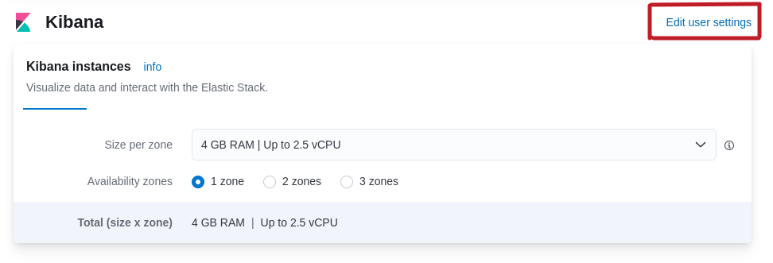
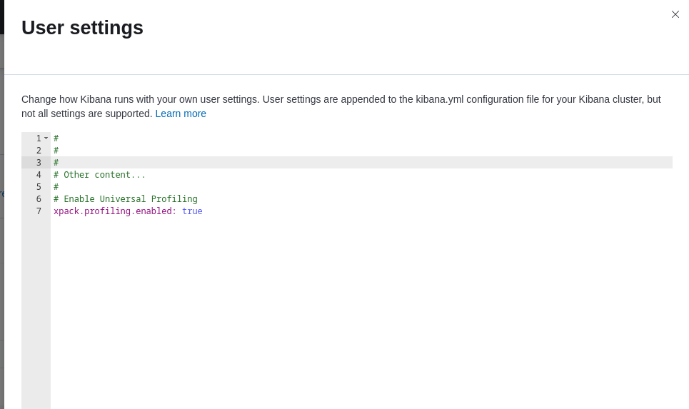
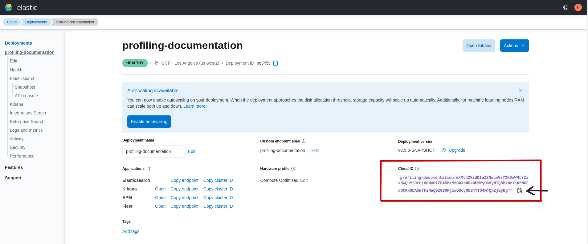

<p align="center">
  
</p>

Welcome to the **private beta** documentation for Universal Profiling.

This documentation will help you configure and use Universal Profiling. We would appreciate feedback on your experience
with this product and any other profiling pain points you may have. See the **[Send Feedback](#send-feedback)** section
at the end of this documentation for more information.

Continue to the next section to get started with Universal Profiling.

If you've completed the initial setup, continue to [Universal Profiling features](./features.md).

## Get started with Universal Profiling

At the moment, Universal Profiling is **only available on [Elastic Cloud](http://cloud.elastic.co)**.
Eventually, it may also be available on self-managed or open-source distributions of the Elastic stack.

Enabling Universal Profiling on a deployment currently requires some manual actions. Many of these actions will be
automated in upcoming releases.

### Prerequisites

Before setting up Universal Profiling, check the following prerequisites:

- a deployment at version 8.5.0 or higher (you can either provision a new one or upgrade an existing one).
- the Integrations Server must be enabled in the deployment.
- credentials (either an API key or username/password) for the `superuser` Elasticsearch role (typically,
  the `elastic` user).
- a Linux machine with a terminal to run commands.

### Deployment configuration example

Before creating a new cluster or upgrading an existing one, review the suggested configuration tier for each Elastic
stack component.

The deployment configuration example in the following table was tested to support profiling data from a fleet of up to
500 hosts, each with 8 or 16 CPU cores, for a total of roughly 6000 cores.

| Component           | Size per zone (memory) | Zones | 
|---------------------|------------------------|-------|
| Elasticsearch       | 64 GB                  | 2     |
| Kibana              | 8 GB                   | 1     |
| Integrations Server | 8 GB                   | 1     |

Even if you're profiling a smaller fleet, we recommend configuring at least 2 zones for Elasticsearch and 4 GB of memory
each for the Integrations Server and Kibana.

### Setting up Universal Profiling on a Cloud deployment

Follow these steps to enable the Universal Profiling app in Kibana:

1. Log in to [Elastic Cloud](https://cloud.elastic.co) and locate your deployment.
2. Click the **Manage deployment** icon next to your deployment.
3. Click **Edit** in the navigation menu.
4. Scroll down to the Kibana section, and click **Edit user settings**.
   
5. Add this line to the user settings:
   ```yaml
   xpack.profiling.enabled: true
   ```
   
6. Click **Back** at the bottom of the **User settings** pane.
7. Scroll to the bottom of the **Edit** page, and click **Save** to save your settings.
8. If you encounter an error when updating your configuration, [submit a support request](#submit-a-support-request)
   to have the line from step four added to your Kibana user settings.

Once Kibana has the Universal Profiling app enabled, it's located under **Observability** in the navigation menu.

Next, follow these steps to configure data ingestion:

1. Copy your deployment's Cloud ID from the deployment overview page.
   
1. On your Linux machine, open a terminal to execute the following steps.
1. Download and extract the `elastic-profiling` CLI by replacing the `<PROVIDED_URL>` placeholder in the following example with the URL you received in your private beta onboarding call:
   ```bash
   wget -O- <PROVIDED_URL> | tar xz
   chmod +x elastic-profiling
   ```
    If you haven't signed up for the private beta, sign up [here](https://docs.google.com/forms/d/e/1FAIpQLSd-SWVgvhO7Z_jAfaV9_bFGa0dUZPuX0JORzPGS8SDP7G-dVQ/viewform).
  
1. Use the Cloud ID and the `superuser` Elasticsearch credentials to set up Universal Profiling in your deployment.
   In the following example, replace the placeholders in `<>` with the proper values for your deployment.
   ```
   ./elastic-profiling setup cloud --reset --cloud-id=<CLOUD_ID> --es-user=<ES_USERNAME> --es-password=<ES_PASSWORD>
   ```
1. Confirm that this is the first time setting up Universal Profiling in the terminal prompt.
   If Universal Profiling has already been installed, confirm with your cluster administrator that it's ok to erase all
   existing profiling data.

### Installing the host-agent

The host-agent is the component that profiles your fleet and needs to be installed and configured on every machine that
you want to profile. The following instructions guide you through the basic setup of a host-agent on your Linux machine.

If everything is working correctly, you can deploy the host-agent across your fleet in the final step of the following instructions:

1. Copy your deployment's APM Cluster ID from the deployment overview page.
   
1. Copy your deployment's Cloud ID from the deployment overview page (like in the first step of the previous section).
1. Use `elastic-profiling` to print the host-agent installation and configuration instructions for various package formats.
   The default package format is binary but there are also instructions for DEB, RPM, Docker and Kubernetes. The DEB and
   RPM package formats contain systemd service definitions that will ensure the host-agent stays running as a service.

   You can list all available package formats by running:
   ```bash
   ./elastic-profiling help config
   ```

1. Print the `binary` configuration to test it on your current Linux machine:
   ```bash
   ./elastic-profiling config --binary --apm-cluster-id=<APM_CLUSTER_ID> --cloud-id=<CLOUD_ID> \
     --es-user=<ES_USERNAME> --es-password=<ES_PASSWORD>
   ```
1. Run the host-agent with the provided steps, testing that your Universal Profiling deployment is working as expected.
   The host-agent will print out logs that will notify you if the connection to Elastic Cloud is not working.
   In this case, see [troubleshooting and support](#troubleshooting-and-support).
1. After a few minutes, open Kibana and confirm you can see stacktraces data coming from your host.
   Navigate to the **Threads** tab in **Observability > Universal Profiling > Stacktraces**. You should see a graph and a
   list of processes.
1. You can now print more configurations to deploy the host-agents on your fleet.

**Notes on the host-agent configuration**

`elastic-profiling config` prints a default configuration that allows ingesting data into a Cloud deployment.
There is only one config knob that you can change: `project-id` (default value is `1`).

The `-project-id` flag, or the `project-id` key in the host-agent configuration file, is a parameter to split
profiling data into logical groups that you control.

You are free to assign any non-zero, unsigned integer to a host-agent deployment you control. This is helpful when
slicing profiling data in Kibana.

You may want to set a per-environment project ID (i.e. dev=3, staging=2, production=1), a per-datacenter project ID (
i.e. DC1=1, DC2=2), or even a per-k8s-cluster project ID (i.e. us-west2-production=100, eu-west1-production=101).

Note that the printed configuration uses a `stable` version.
This is good for testing environments, but for production we recommend to use immutable, versioned artifacts.

The host-agent versioning scheme is **not aligned with the Elastic stack version scheme**.

The OS packages downloaded from `releases.prodfiler.com` have a version in their file name.

For container images, you can find a list of versions in the
[Elastic container library repository](https://container-library.elastic.co/r/observability/profiling-agent).

For Kubernetes deployments, the Helm chart version is already used to configure the same container image, unless
overwritten with the `version` parameter in values.

### Adding symbols for native frames

To see function names and line numbers in traces of applications written in programming languages that 
compile to native code (C, C++, Rust, Go, ...), the user must first push symbols to the cluster. This
is done using the `elastic-profiling push-symbols` command. All variants of this command require the
same authentication parameters as the `config` command discussed in previous sections of this document:

```
   --apm-cluster-id=<cluster id>
   --cloud-id=<cloud id>
   --es-user=<elasticsearch user>
   --es-password=<elasticsearch password>
```

These four parameters are referred to as `<auth args>` in the following sub-sections.

#### Go applications

The meta-information present in Go binaries allows them to be symbolized even if they were stripped.
No additional parameters need to be passed during the build. To push symbols for a Go binary, simply 
invoke the `elastic-profiling` tool like this:

```
./elastic-profiling push-symbols executable <auth args> -e ./my-go-app 
```

#### C, C++ and Rust applications

C/C++ applications must be built with debug symbols (`-g`) for symbolization to work. Rust applications
must be built with [`debug = 1`][cargo-debug] (or higher). The debug info doesn't have to be deployed to 
production, but needs to be present temporarily to push them to the Elastic cluster. 

[cargo-debug]: https://doc.rust-lang.org/cargo/reference/profiles.html#debug

If you don't mind deploying your applications with debug symbols, you can simply do:

```
./elastic-profiling push-symbols executable <auth args> -e ./my-c-app 
```

If you don't want debug symbols in production, simply copy the executable and strip the copy.
You can then use the `-d` argument to instruct the tool to read the symbols from the original
unstripped binary while still calculating the file hash from the final stripped binary. After
the symbols have been pushed, the unstripped binary can be removed.

```
cp ./my-app ./my-stripped-app
strip ./my-stripped-app
./elastic-profiling push-symbols executable <auth args> -e ./my-stripped-app -d ./my-app
rm ./my-app
```

> **Warning**
>
> Simply pushing debug information and then stripping the binary later **will not work**:
> the executable passed via the `-e` argument is used to calculate the file hash that
> associates stack traces with their symbols and stripping the binary later will change that hash.

#### Linux distribution packages

For Debian, Ubuntu, Fedora and Arch Linux, the `elastic-profiling` tool supports pushing symbols
for an entire package at once. The required debug symbols are automatically retrieved from
the distribution's [debuginfod] server.

[debuginfod]: https://wiki.debian.org/Debuginfod

For this to work, please make sure that the debuginfod client is installed on your machine.

| Distro | Install command                               |
|--------|-----------------------------------------------|
| Debian | `sudo apt install debuginfod`                 |
| Ubuntu | `sudo apt install debuginfod`                 |
| Fedora | `sudo dnf install elfutils-debuginfod-client` |
| Arch   | `sudo pacman -S debuginfod`                   |

Then, invoke `elastic-profiling` as follows:

```
./elastic-profiling push-symbols package <auth args> -p package-name
```

For example, to push symbols for libc on Debian:

```
./elastic-profiling push-symbols package <auth args> -p libc6
```

Note that debuginfod servers for many distributions tend to be rather unreliable: if the tool
ends up printing `No debug info found for executable, skipping.` for all executables in a
package, this is likely the reason. This is more likely to take place if you're on a faster
moving release-channel of your distribution (e.g. Debian Testing).

#### Native symbolization limitations

In the current beta release of Elastic Universal Profiling, native symbolization is still limited
in a few important ways:

- No virtual frames for inline functions
- No symbols for leaf frames (top-most frame in a trace)
- No automatic insertion of debug symbols for OS packages

We're aiming that these limitations be improved on and eventually lifted in later versions.

> **Note**
>
> If symbols are not displayed in Kibana after ingesting them, try restarting Kibana in your deployment (Cloud Cloud -> Deployments -> Kibana --> Force Restart). 
> This is a known issue in 8.5 and will be fixed in later versions. 


### Troubleshooting and support

We mentioned earlier that you can spot errors in the host-agent logs.

The following is an example of a _healthy_ host-agent output:

```
time="..." level=info msg="Starting Prodfiler Host Agent v2.4.0 (revision develop-5cce978a, build timestamp 12345678910)"
time="..." level=info msg="Interpreter tracers: perl,php,python,hotspot,ruby,v8"
time="..." level=info msg="Automatically determining environment and machine ID ..."
time="..." level=warning msg="Environment tester (gcp) failed: failed to get GCP metadata: Get \"http://169.254.169.254/computeMetadata/v1/instance/id\": dial tcp 169.254.169.254:80: i/o timeout"
time="..." level=warning msg="Environment tester (azure) failed: failed to get azure metadata: Get \"http://169.254.169.254/metadata/instance/compute?api-version=2020-09-01&format=json\": context deadline exceeded (Client.Timeout exceeded while awaiting headers)"
time="..." level=warning msg="Environment tester (aws) failed: failed to get aws metadata: EC2MetadataRequestError: failed to get EC2 instance identity document\ncaused by: RequestError: send request failed\ncaused by: Get \"http://169.254.169.254/latest/dynamic/instance-identity/document\": context deadline exceeded (Client.Timeout exceeded while awaiting headers)"
time="..." level=info msg="Environment: hardware, machine ID: 0xdeadbeefdeadbeef"
time="..." level=info msg="Assigned ProjectID: 5"
time="..." level=info msg="Start CPU metrics"
time="..." level=info msg="Start I/O metrics"
time="..." level=info msg="Found tpbase offset: 9320 (via x86_fsbase_write_task)"
time="..." level=info msg="Environment variable KUBERNETES_SERVICE_HOST not set"
time="..." level=info msg="Supports eBPF map batch operations"
time="..." level=info msg="eBPF tracer loaded"
time="..." level=info msg="Attached tracer program"
time="..." level=info msg="Attached sched monitor"
```

You can confirm that a host-agent deployment is working if you run the following command and it has an empty output:

```bash
head host-agent.log -n 15 | grep "level=error"
```

If the output of the previous command contains error level logs, the following are possible causes:

- The host-agent is running on an unsupported version of the Linux kernel, or it can't perform its operations because
   of missing kernel features.

   In case of an outdated kernel version, this message will be logged:
   ```text
   Host Agent requires kernel version 4.15 or newer but got 3.10.0
   ```

   In case of eBPF features not being available in the kernel, the host-agent will fail starting up, and the logs will
   contain:
   ```text
   Failed to probe eBPF syscall
   ```
   or
   ```text
   Failed to probe tracepoint
   ```

- The host-agent is not able to connect to Elastic Cloud.
   In this case, you should see a message like the following:
   ```text
   Failed to setup gRPC connection (retrying...): context deadline exceeded
   ```

   Verify the `collection-agent` configuration value is set and is equal to what was printed
   by `elastic-profiling config`.

- The secret token is not valid, or it has been changed.
   In this case, the host-agent will shut down, logging an error message like the following:
   ```text
   rpc error: code = Unauthenticated desc = authentication failed
   ```

If you are unable to find a solution to the host-agent failure, you can raise a support request
indicating `Universal Profiling` and `host-agent` as source of the problem.

#### Enabling verbose logging in host-agent

During the support process, you may be asked to provide debug logs from one of the host-agent installations from your
deployment.

**We recommend only enabling debug logs on a single instance of host-agent**, rather than an entire deployment because
of the amount of logs produced.

To enable debug logs, add the `-verbose` command-line flag or the `verbose true` setting in the configuration file.

#### Submit a support request

Reach the [support request page](https://cloud.elastic.co/support) in the Cloud console.

Depending on what type of problem you faced during the setup or operation of Universal Profiling, please specify in the
request if the problem is in the host-agent or the Kibana app.

#### Send feedback

If troubleshooting and support are not working for you, or you have any other feedback that you want to share about the
product, send the Profiling team an email at `profiling-feedback@elastic.co`.
