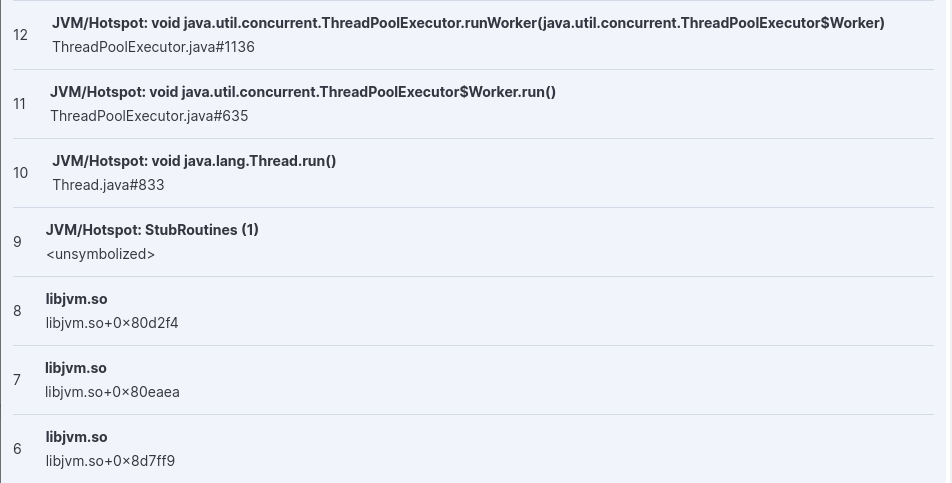
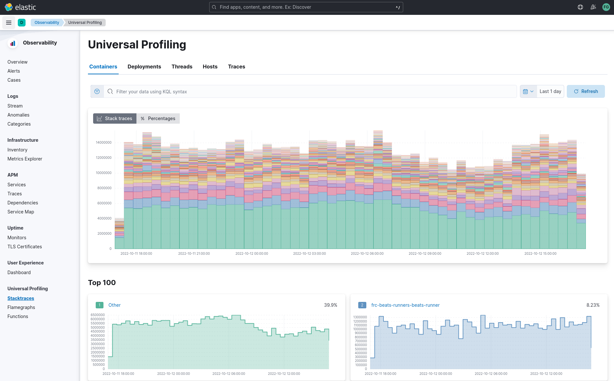
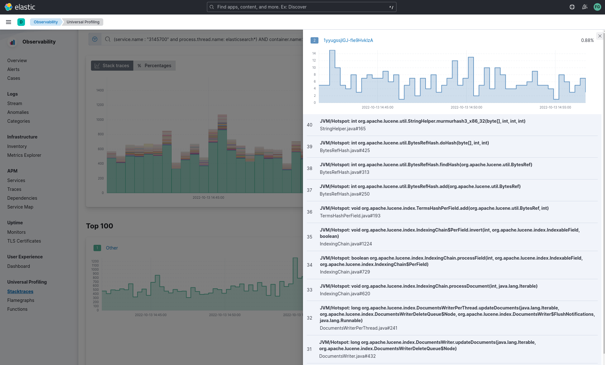
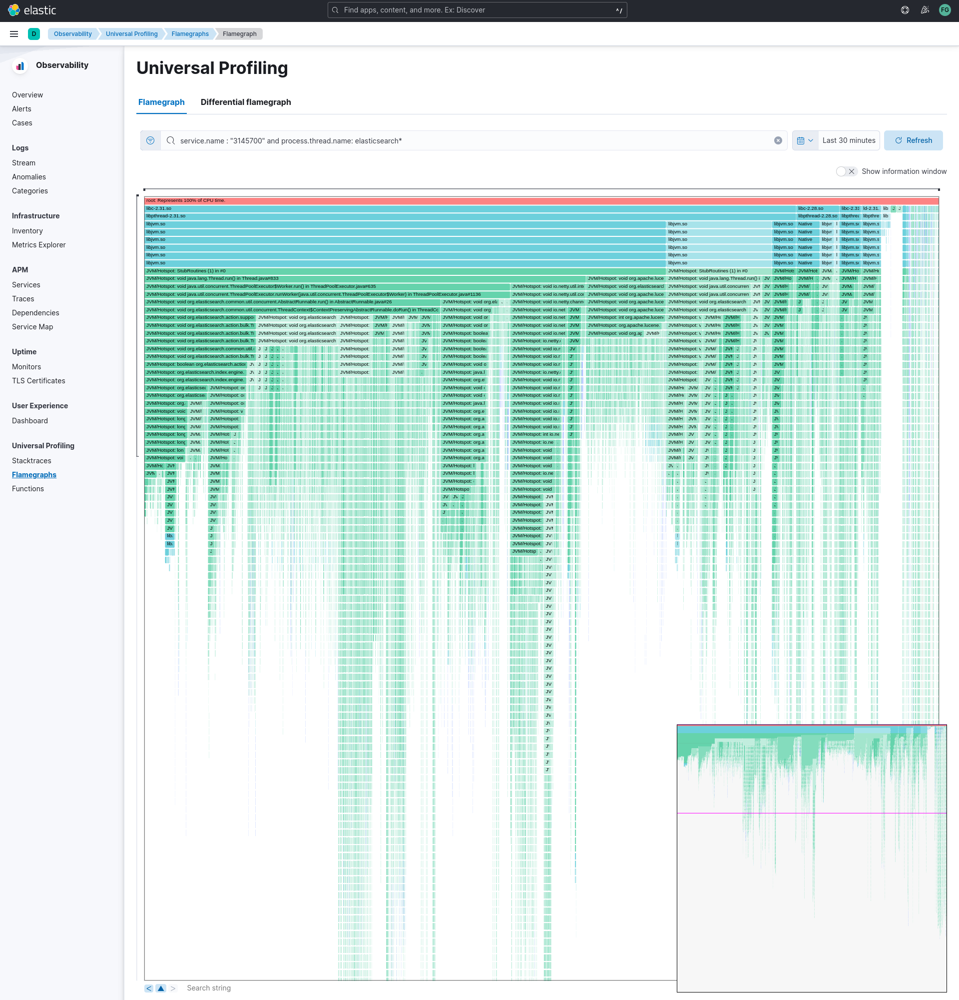
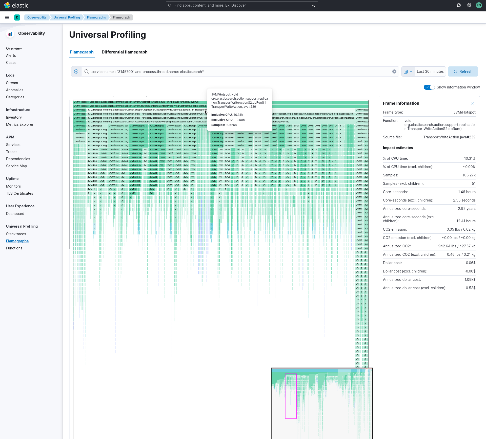
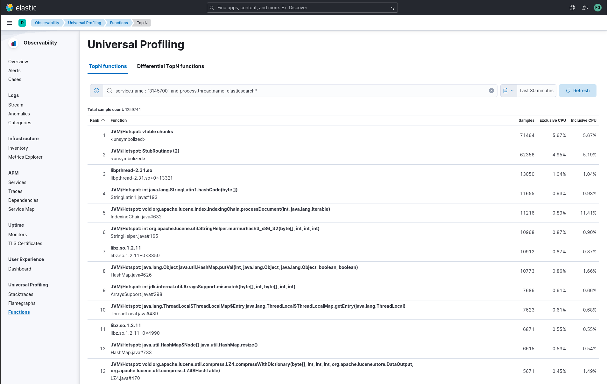
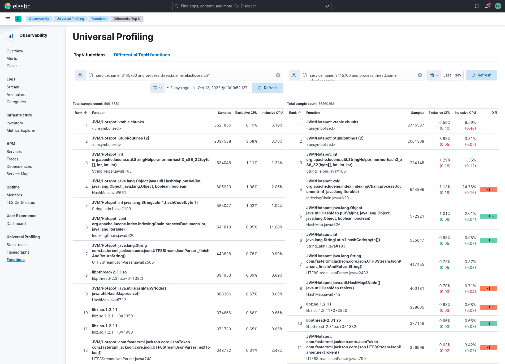
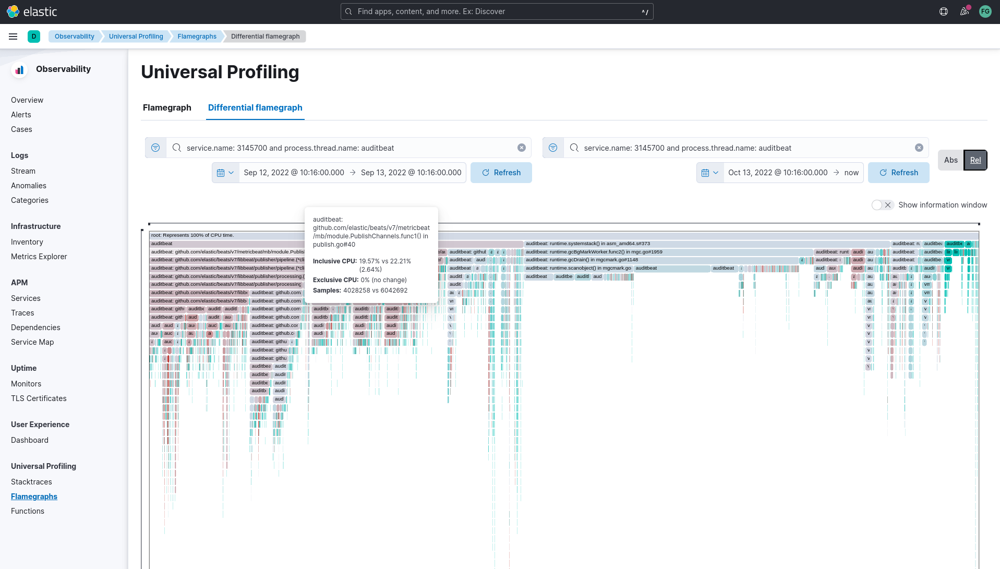

## Universal Profiling features

Elastic Universal Profiling is a continuous profiling tool running on top of the Elastic stack.

For more details, see
the [Elastic Universal Profiling product page](https://www.elastic.co/observability/ebpf-continuous-code-profiling)

### Inspecting data in Kibana

When opening Kibana, find in the left menu the "Observability" section, and click on "Universal Profiling" to get
started. You are presented with the [stacktraces](#stacktraces) view.

Universal Profiling currently only supports CPU profiling (via stack sampling).

From the landing page, you can get an overview of the entirety of your data, and slice and dice into more detailed
sections of your fleet by using filtering queries in the search bar.
You can apply both time-based filters and property filters, inspecting more narrow portions of data and drilling down
into how much CPU various parts of your infrastructure consume over time.

See [filtering](#filtering) for more details on how to slice data, and [differential views](#differential-views) to understand how to
compare
two time ranges to detect performance improvements or regressions.

#### Premise on debug symbols

Profiles' stacktrace may be either symbolized, showing the full source code's filename and line number, or partially
symbolized, or not symbolized at all.

Notice how unsymbolized frames _do not_ show a filename and line number, but a hexadecimal number such as `0x80d2f4`
or `<unsymbolized>`.

Adding symbols for unsymbolized frames is a manual operation for now, see
[Adding symbols for native frames](./README.md#adding-symbols-for-native-frames).

#### Stacktraces

In the landing page you will see graphs of stacktraces grouped by containers, deployments, threads, hosts and
traces.

These groupings are derived from the origin of collected stacktraces. You may find an empty view in containers and
deployments if your host-agent deployment is profiling systems that do not run any containers, or container
orchestrators.

In a deployment where Universal Profiling is correctly receiving data from host-agents you should _always_ see a graph
in the threads, hosts and traces view.

Here is a summary of the type of groupings in each view:

* Containers: stacktraces grouped by container name discovered by the host-agent
* Deployments: stacktraces grouped by deployment name set by the container orchestration (e.g. Kubernetes `ReplicaSet`,
  `DaemonSet`, or `StatefulSet` name)
* Threads: stacktraces grouped by process' thread name
* Hosts: stacktraces grouped by machine's hostname or IP
* Traces: un-grouped stacktraces

You can hover and click each of the stacked barchart sections to show details.

You can arrange the graph to display absolute values, or relative percentage values.

Below the top graph, a list of smaller graphs show the individual trend-line for each of the items.

The percentage displayed in the top-right corner of every smaller graph is the _relative_ number of occurrences of
every time over the total of samples in the group.

**Do not confuse the displayed percentage with percentage of CPU usage**: Universal Profiler is not meant to show
absolute monitoring data, rather it allows for relative comparisons between software running in your infrastructure (e.g. which is the most expensive?)

The smaller graphs are ordered in decreasing order, from top to bottom, left to right.

In the "Traces" tab, clicking on "Show more" in each of the smaller graphs will show the full
stacktrace.

Some possible use cases for the stacktraces view:

* discover which container, deployed across a multitude of machines, is the heaviest CPU hitter
* discover how much relative overhead comes from third-party software running on your machines
* detect unexpected CPU spikes across threads, and drill down into a smaller time range to investigate further with a
  flamegraph

#### Flamegraphs

A flamegraph is a visualization technique that groups hierarchical data (stacktraces) into rectangles stacked onto
or next to each other. The size of each rectangle represents the relative weight of a child compared to the parent.

Flamegraphs provide immediate feedback on which parts of the software should be searched first for optimization
opportunities, highlighting the hottest code paths across your entire infrastructure.

You can navigate a flamegraph on two axes:

* Horizontally: every process that is sampled will have at least a rectangle under the `root`
  frame. In Universal Profiling flamegraphs you will likely discover the existence of processes you don't control, but
  that are eating a significant portion of your CPU resources.
* Vertically: traversing a process' call stack will allow to identify which parts of the process are executing most
  frequently. This allows pinpointing functions or methods that _should_ be negligible, and are instead found to be a
  big portion of your call sites.

Drag the graph up, down, right or left to move the visible area.

You can zoom in and out of a subset of stacktraces, by clicking on individual frames or scrolling up in the colored
view.

The summary square in the bottom-left corner of the graph lets you shift the visible area of the graph.
Note how the position of the summary square is adjusted when you drag the flamegraph, and vice-versa: moving the summary square
will reflect the visible area in the bigger panel.

Enabling "Show information window" on the right will display a list of entries in a panel on the right.
Clicking on each rectangle in the flamegraph will highlight the frame's detail in the right panel.

Below the graph area, a search bar allows to highlight specific text in the flamegraph; here you may search binaries,
function or file names and move over the occurrences.

Common use cases for flamegraphs:

* detect unexpected usage of system calls or native libraries linked to your own software: Universal Profiling is able
  to unwind stacktraces across user-space boundary into kernel-space
* inspect the call stacks of the most CPU-intensive application, detecting hot code paths and scouting for optimization
  opportunities
* find "deep" call stack, usually hinting areas where there are many indirections across classes or objects

#### Functions

The functions view presents an ordered list of functions that are sampled the most by Universal Profiling.
From this view, you can spot the functions that are running the most across your entire infrastructure, applying filters
to drill down into individual components.

### Filtering

In every view mentioned above, the search bar accepts a filter in the Kibana Query
Language ([KQL](https://www.elastic.co/guide/en/kibana/current/kuery-query.html)).

Most notably, you may want to filter on:

- `service.name`: the corresponding value of `project-id` host-agent flag, logical group of deployed host-agents
- `process.thread.name`: the process' thread name, e.g. `python`, `java`, or `kauditd`
- `orchestrator.resource.name`: the name of the group of the containerized deployment as set by the orchestrator
- `container.name`: the name of the single container instance, as set by the container engine
- `host.name` or `host.ipstring`: the machine's hostname or IP address (useful for debugging issues on a single Virtual
  Machine)

### Differential views

The flamegraphs and functions views can be turned into differential views, comparing data from two distinct time ranges
or across multiple dimensions.

When switching to "Differential flamegraph" or "Differential TopN functions" from the tabs at the top, notice that you
now see two separate search bars and datetime pickers.
The left-most filters represent the data you want to use as baseline for comparison, while the right-most filters
represents the data that will be compared against the baseline.

Hitting refresh on each of the data filters will trigger a frequency comparison, that will highlight how the CPU usage
has changed.

In differential functions, note how the right-most column of functions has green or orange score calculator: they
represent the relative difference of position as the heaviest CPU hitting functions.

In differentials flamegraphs, the difference with the baseline is highlighted with color and hue: a more vivid
green colored rectangle indicates that a frame has been seen in _less_ samples compared to the baseline, which means
an improvement. In contrast, rectangles colored by a vivid red are a sign of more samples being recorded on CPU,
therefore indicating a potential performance regression.

### Resource constraints

One of the key goals of Universal Profiling is to have net positive cost benefit for users: the cost of profiling and
observing applications should not be higher than the savings produced by the optimizations.

In this spirit, both the host-agent and storage are engineered to use as little resources as possible.

#### Elasticsearch storage

Universal Profiling storage budget is predictable on a per-profiled-core basis: the data we generate at the fixed
sampling frequency of 20 Hz, will be stored in Elasticsearch at the rate of 20 MB per core per day.

#### Host-agent CPU and memory

Because Universal Profiling provides whole-system continuous profiling, the resource usage of host-agent is highly
correlated with the number of processes running on the machine.

We have recorded real-world, in-production host-agent deployments to be consuming between 0.5% and 1% of CPU time,
with the process' memory being as low as 50 MB, and as high as 250 MB on busier hosts.
